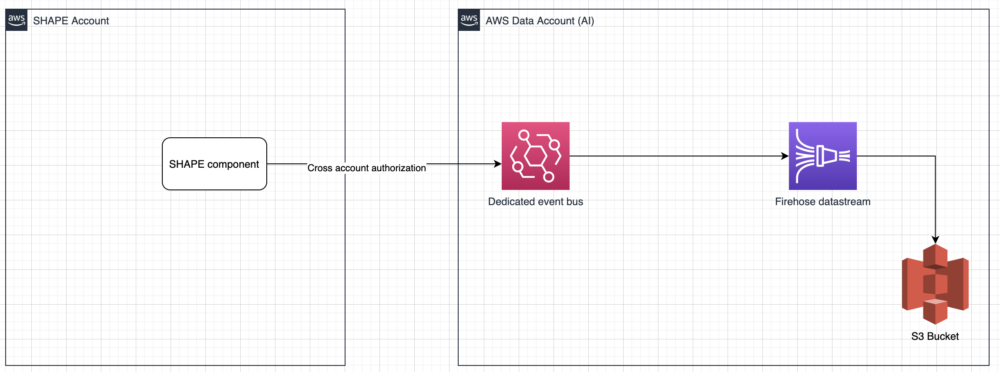

# SHAPE Dvault

This repo contains all the Terraform files necessary to deploy the DVAULT infrastructure for shape

In order to receive events an AWS Cloudwatch Event Bus is set up (with cross account permission) for receiving events. A proper defined rule then sends those data onto a Kinesis Firehose Datastream that streams the files into a specific S3 bucket

**High level design**

