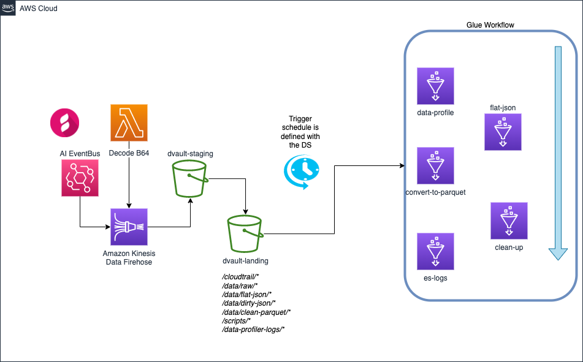

# Shape dvaults ETL pipeline

## Purpose/Goals

Shape is one of the application that compose the Docebo Learning Suite. In a nutshell, it can take several media formats and create presentations for courses and presentations on demand thanks to the use of several AI models coupled together. The tool is maintained by the _shape-ai_ team, but the models beneath are developed by the AI team.

This project will help to collect the dvaults, files generated by the Shape application, and present them in a useful way to the data scientists of the AI team so that they can make educated guesses on the current models performances and/or initiate models re-training.

### Dvaults:

A _dvault_ is a highly nested JSON file that is generated by one of the AI services that is used in the Shape application. These services are:

- Summarizer
- Headliner
- STE

More can be added in the future and each one of them present some common attributes, while others are very specific to the service.
Furthermore, the dvaults can be divided between **predictions**(generated by the AI service) or **events** (generated by the user actions on the Shape application).

More details are available on the [dvault Confluence page](https://docebo.atlassian.net/wiki/spaces/AI/pages/1698332715/D-Vault+events).

## Pipeline design

### Data assumptions

- The dvault files arrive a the _landing_ bucket already decoded.
- Data profiling is carried on batches of events, which are exploded on the fly to make sure that data expectations are met. Successful events are stored in _data/clean_dvaults_, while problematic events are stored in _data/dirty_dvaults_.
- Data exception must be investigated manually, correct and later re-uploaded into _data/raw_ for processing.
- Media files might be missing from STE events due to the nature of the user action.
- At minimum the dvault must have the following fields:
  - identifier for either **prediction** or **event**.
  - identifier for the service of origin
- Parquet are appended and scanned via Athena. If there is a schema change, the files must be re-processed from _dvault-staging_

### Athena database

The database is populated with as many tables as there are AI services involved in Shape. Each AI service is divided in **prediction** and **event**.

Therefore the tables so far are:

- HEADLINER_EVENT
- HEADLINER_PRED
- STE_EVENT
- STE_PRED
- SUMMARIZER_EVENT
- SUMMARIZER_PRED

The tables are hosted onto the Glue Data Catalog and populated by the Glue Crawler that scans the Parquet files at the final stage of the ETL pipeline.

## Future improvements

- Make the ETL pipeline event-driven via Cloudtrail and Eventbridge.
- Create views in Athena to export datasets for re-training effort.

## Testing the pipeline

At the current state, the project is tested via CI/CD pipeline in Gitlab. Tests are allocated in _test/_ folder.

Two types of tests are run:

- Unit tests.
- End-to-end tests.

### Unit testing:

The unit testing of the project occurs at two levels:

- Terraform plan output.
- Glue Job scripts.

Inside the CI/CD pipeline, on can use the command `./push_tags.sh unit-test` to run just these type of tests inside the project.

### End to end testing:

The E2E testing performed inside the project comprise a dev depoyment of the infrastructure in AWS, along with a helping script located in _test/end_to_end_tests/run_e2e_test.py_ to perform these actions:

- Upload testing input from _test/end_to_end_tests/data/input_ into AWS.
- Start Glue workflow via boto3.
- Wait until the workflow has processed the files.
- Compare content of final Parquet files with expected results in _test/end_to_end_tests/data/expected_.

If final and expected files are different in their own content, the job fails.
