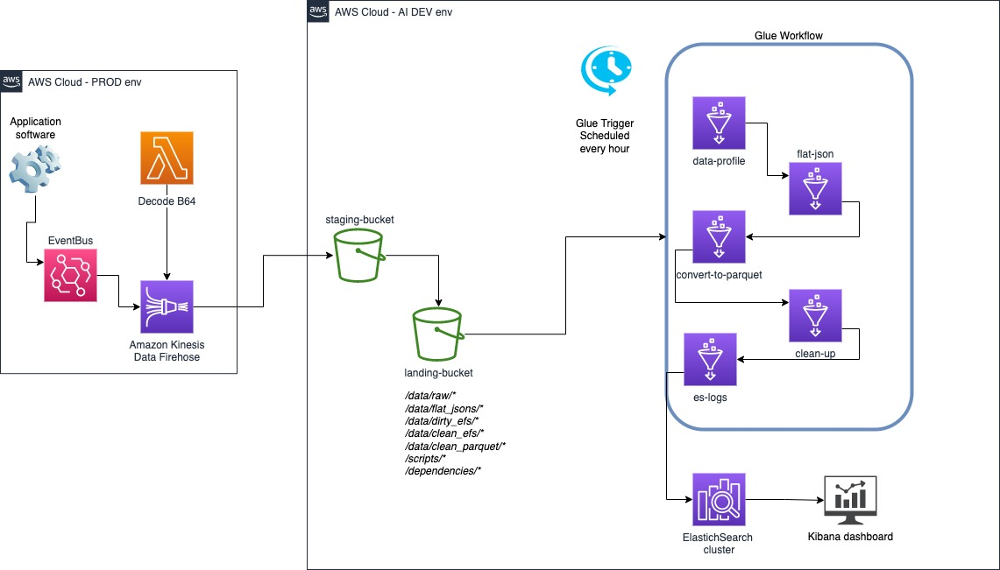

# AWS Glue ETL pipeline

## Purpose/Goals

This project collects event files generated by an application, which is made up by several microservices.
Each microservice can provie information about its functionality and how the average user behaves with the final output.
This set of information becomes useful for the developer team that need to understand how the application is behaving in a _PRODUCTION_ environment and what type of enhancements can be scheduled for the following Sprints.

The project perform ETL via [AWS Glue Workflow](https://docs.aws.amazon.com/glue/latest/dg/workflows_overview.html), a service offered under the AWS Glue umbrella to perform ETL operations on data.

The deployment and separation of different environements (ex: dev, e2e-test, prod) is provvided with [Terraform](https://www.terraform.io/), by leveraging the workspaces feature.

Data profiling results are stores and displayed via [ElasticSearch and Kibana](https://www.elastic.co/kibana/), deployed via Docker inside the dedicated `data_observability/` folder.

### Event files:

A single event file is a highly nested JSON file that is generated by one of the microservice. These services are:

- microOne
- microTwo
- microThree

More can be added in the future and each one of them present some common attributes, while others are very specific to the service itself.
Furthermore, the event files can be divided between **predictions** (generated by the microservice) or **events** (generated by the user actions on the main application).

By extracting information from these types of file it is possible to gain insight on how the microservice behaves in time, while gathering basic feedback information from the users.

## Pipeline design



### Data assumptions

- The event file files arrive at the _source_ bucket already decoded.
- The pipeline takes care of implementing a look-up system to skip event files already processed.
- Data profiling is carried on batches of events, which are exploded on the fly to make sure that defined data expectations are met. Successful events are collected in _data/clean_efs_, while problematic events are stored in _data/dirty_efs_.
- At minimum the event file must have the following fields:
  - identifier for either **prediction** or **event**.
  - identifier for the service of origin
- Final output are Parquet files, which are partitioned for ater investigation by the data scientist.

### Final parquet files

Each parquet file in _data/clean_parquet_ holds data for an individual microservice involved in the main application. Each microservice is divided in **prediction** and **event**.

Therefore the tables so far are:

- MICROONE_EVENT
- MICROONE_PRED
- MICROTWO_EVENT
- MICROTWO_PRED
- MICROTHREE_EVENT
- MICROTHREE_PRED

In the first version of the ETL pipeline, the data scientist must investigate the content of the parquet files and decide which data should be deserialized from the event file structure.

### Data observability

In order to keep an eye into the data movement inside the ETL pipeline, the final step of a succesful workflow run is to load the _data-profiling_ logs into an ElasticSearch cluster.

A Kibana board is provided to inspect common metrics while data is profiled inside the pipeline. The index name inside ElasticSeach is _event_file_logs\_{env}_, where _{env}_ represent the different version of the pipeline (ex: dev, prod, e2e-test).

## Testing the pipeline

At the current state, the project is tested via CI/CD pipeline in Gitlab. Tests are allocated in _test/_ folder.

Two types of tests are run:

- Unit tests.
- End-to-end tests.

### Unit testing:

The unit testing of the project occurs at two levels:

- Terraform plan output.
- Glue Job scripts.

### End to end testing:

The E2E testing performed inside the project comprise a dev deployment of the infrastructure in AWS, along with a helping script located in _test/end_to_end_tests/run_e2e_test.py_ to perform these actions:

- Upload testing input from _test/end_to_end_tests/data/input_ into AWS.
- Start Glue workflow via boto3.
- Wait until the workflow has processed the files.
- Compare content of final Parquet files with expected results in _test/end_to_end_tests/data/expected_.

If _final_ and _expected_ files are different in their own content, the job fails.

## How to run the project

Make sure to have:

- Terraform
- an account with AWS (charges will occur)
- awscli with all credentials set up

1. Navigate to `deployments` and run

```bash
terraform init
```

2. The project is based on Terraform workspaces (dev, e2e-test and prod). _prod_ is ignored and I would suggest to launch the _dev_ workspace via:

```bash
terraform workspace new dev
```

3. Deploy the services:

```bash
terraform apply --auto-approve --parallelism=1
```

4. Once complete, go to `test/end_to_end_tests/data/input`:

```bash
cd ../test/end_to_end_tests/data/input
```

5. Copy the input files to the landing bucket `s3://ef-ingestion-landing-dev/`:

```bash
aws s3 cp . s3://ef-ingestion-landing-dev/data/raw/ --recursive
```

6. Open the AWS console and navigate to Glue > Workflows. Start `ef-ingestion-batch-dev` via console or type on the terminal:

```bash
aws glue start-workflow-run --name ef-ingestion-batch-dev
```

7. Wait until the process is over and later inspect the files inside the bucket. Refer to the diagram above to understand the topology of the bucket.
