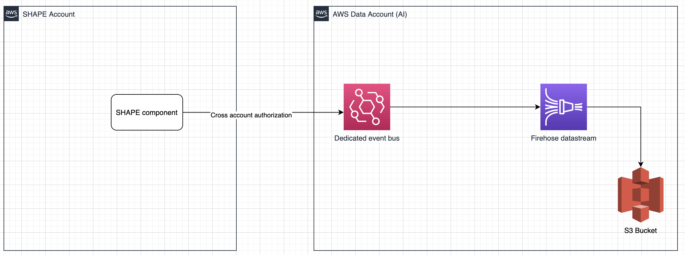

# SHAPE Dvault

This repo contains all the Terraform files necessary to deploy the DVAULT infrastructure for shape

In order to receive events an AWS Cloudwatch Event Bus is set up (with cross account permission) for receiving events. A proper defined rule then sends those data onto a Kinesis Firehose Datastream that streams the files into a specific S3 bucket

**High level design**

## Terraform deployment

The infrastructure is defined in Terraform under the `dvault-infrastructure` folder that container the following files: 
1. `dvault-infrastructure.tf` Main Terraform file containing the AWS infrastructure
2. `variables.tf` Variables declaration
3. `terraform.tfvars` Deployment variables definition 

### Prerequistes

AWS CLI is configured in your terminal with proper credentials to access target account

### Deployment

1. Compile `terraform.tfvars` file according to your needs (if it's a new deployment please remember to change state file key)
2. `cd dvault-infrastructure`
3. Init terraform plugins `terraform init`
4. Deploy `terraform apply` (it will previously shows the deployment plan)

As result the designed infrastructure should be deployed

## Test 

A `test-event.json` file is provided for testing the file delivery. 
Please compile `EventBusName` field type in the JSON file with the target event bus ARN. 

To send the file simply launch `aws events put-events --entries file://test-event.json` (from the root of the project)
After 5 minutes firehose will deliver the file to S3